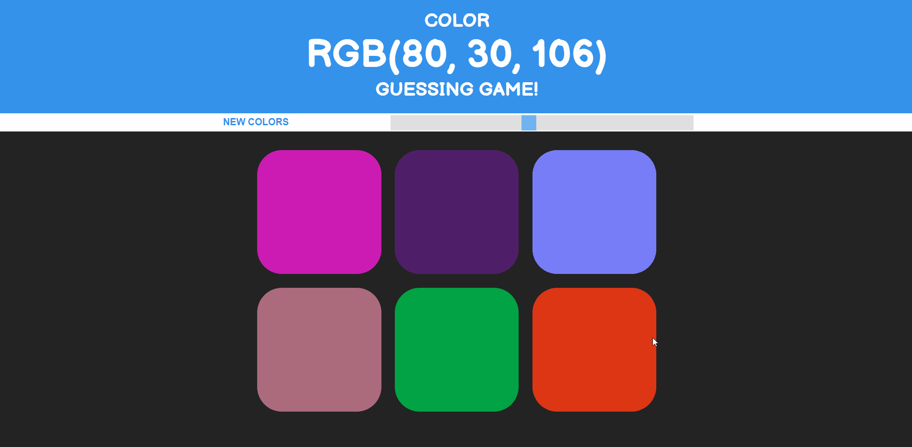

# RBG Color Game
Given a RGB value, determine which square matches that color. Reset the colors by selecting the "New Color" button. Change the difficulty with the slider which adds or removes tiles.

